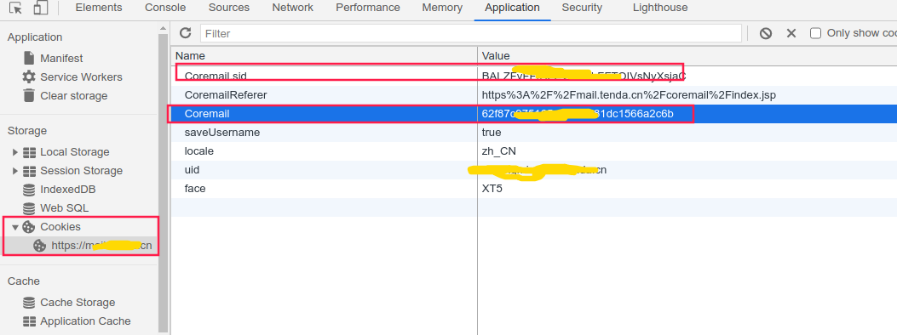

# coremail-address-book

[](https://travis-ci.org/dpu/coremail-address-book)
[](https://github.com/dpu/coremail-address-book/releases)
[](https://raw.githubusercontent.com/dpu/coremail-address-book/master/LICENSE)
[](https://github.com/dpu/coremail-address-book/releases)

📧Coremail邮件系统组织通讯录一键导出

## 安装

### 二进制包
在 [releases](https://github.com/dpu/coremail-address-book/releases) 有各个系统的zip包, 根据系统下载对应的zip文件并解压后使用。

### 源码编译
```shell
$ git clone git@github.com:dpu/coremail-address-book.git
$ cd coremail-address-book
$ go build main.go
$ ./main -h
```

### 使用
```shell
// 查看帮助信息
$ main -h
Usage of ./main:
  -coremail_cookie string
        Coremail value in Request Cookie
  -coremail_sid string
        Coremail.sid value in Request Cookie
  -host string
        Coremail host (default "mail.dlpu.edu.cn")

// 执行导出
// -coremail_cookie 与 -coremail_sid 可在浏览器登录邮箱查看
$ ./main -coremail_cookie=YOUR_COOKIE_COREMAIL -coremail_sid=YOUR_COOKIE_COREMAIL_SID
```

